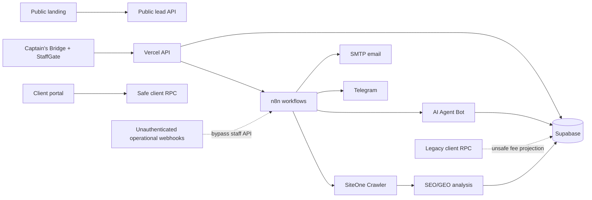

# OfferPSP + AI Agent Bot — генеральный независимый аудит

> **Статус документа после remediation:** исходные находки ниже сохранены как снимок состояния до исправлений. В тот же день выполнена генеральная remediation: оба P0 закрыты, внешние n8n webhook защищены новым общим secret, portal переведён на серверный bridge с проверкой Supabase-сессии и RLS, false-success AIBot удалён, integration health стал реальной безопасной проверкой шлюзов, lifecycle и архивные доступы исправлены миграциями, SEO/GEO получил новый production crawl и evidence-aware AI-анализ, PDF-тест стал самодостаточным, а доказанно недостижимый TailAdmin-код и 108 неиспользуемых assets удалены. Полный локальный набор tests/lint/build и воспроизведение всех миграций с нуля прошли. Живую мобильную UI-проверку повторить не удалось из-за отсутствующего разрешения macOS Computer Use; это ограничение проверки, а не обнаруженный сбой системы.

Дата проверки: 2026-08-14

Область: публичный OfferPSP, Captain's Bridge, клиентский портал, Supabase, n8n, AIBot, почта, Telegram, SiteOne SEO/GEO, Vercel и локальный код

Режим: read-only аудит; production, данные, workflow и код не изменялись

## Итоговый вердикт

**PARTIAL — система настоящая и основное ядро работает, но текущий контур нельзя считать полностью production-safe.**

Это не декорация:

- публичный сайт и staff-приложение обслуживаются Vercel;
- Supabase содержит реальных провайдеров, маршруты, лиды, shortlist, compliance и коммуникации;
- matching и безопасная текущая проекция клиентских офферов существуют;
- SiteOne 14 августа выполнил новый crawl, а SEO/GEO workflow получил результат и вызвал DeepSeek;
- AIBot успешно прошёл реальный голосовой сценарий: распознавание, ответ, Telegram и запись двух сообщений;
- Meilisearch отвечает из живого интерфейса;
- production UI открывается без наблюдавшихся ошибок консоли на проверенных desktop-маршрутах.

Но есть два критических класса проблем:

1. Старый RPC позволяет авторизованному клиенту получить внутренние fee-поля, которые новая безопасная функция специально скрывает.
2. Несколько активных n8n-webhook могут напрямую отправлять email/Telegram или запускать операционные цепочки без надёжной аутентификации, обходя staff-защиту Captain's Bridge.

Кроме этого, найден повторяющийся паттерн **«как будто работает»**: интеграция считается исправной по наличию URL, workflow может завершиться `success` при недоставленном сообщении, AIBot имеет текстовый fallback `«Готово.»`, а SEO-агент превращает слабый сигнал crawler в уверенную техническую рекомендацию, которая противоречит живым HTTP-заголовкам.

До устранения P0 нельзя обещать клиентам строгую конфиденциальность внутренних условий и считать внешние automation-endpoint защищёнными.

## Статусы

- **VERIFIED** — подтверждено кодом, фактическим запросом, execution, deployment, логом или живым UI.
- **PARTIAL** — часть пути работает, но полный end-to-end не доказан.
- **BLOCKED** — проверка невозможна без отсутствующего безопасного доступа или действия, запрещённого режимом аудита.
- **ASSUMPTION** — вывод, который ещё требует проверки.
- **PLACEHOLDER** — интерфейс или узел заявлен, но полезной функции не выполняет.
- **DEAD CODE** — код или ресурсы не входят в текущий продуктовый маршрут.

## 1. Архитектура и фактический путь данных

Главная архитектурная проблема — рядом с текущим защищённым путём продолжают существовать два старых/параллельных входа: legacy RPC и прямые публичные webhook.

## 2. Критические находки

### P0-1 — legacy RPC раскрывает внутренние settlement fee

**Статус: VERIFIED**

`public.list_offerpsp_client_options(uuid)` остаётся `SECURITY DEFINER`, доступен роли `authenticated` и возвращает полный `client_snapshot -> settlement`.

Внутренняя функция `private.offerpsp_build_client_route_snapshot` помещает в этот snapshot:

- `fee_percent`;
- `fixed_fee`;
- `fixed_fee_currency`.

Текущий портал использует более новую `list_offerpsp_client_offers`, которая эти поля удаляет. Однако прямой вызов старого REST RPC остаётся возможен и обходит новую проекцию.

Фактический масштаб текущих данных:

- 81 shortlist item всего;
- 11 snapshot содержат внутренние fee-поля;
- 24 item находятся в shared shortlist;
- 16 item одновременно shared и принадлежат claimed-клиенту;
- 4 таких клиентских candidate item содержат fee-поля.

Provider identity на верхнем уровне этим путём не обнаружена. Находка относится именно к внутренним settlement terms.

**Риск:** утечка внутренней экономики сделки авторизованному клиенту.

**Исправление:** немедленно отозвать `EXECUTE` у `authenticated` для legacy RPC либо удалить функцию; затем добавить прямой regression-тест REST RPC от клиентской роли и проверить все существующие `SECURITY DEFINER` client-facing функции.

### P0-2 — прямые n8n endpoint обходят staff-контур

**Статус: VERIFIED**

В активных workflow обнаружены публичные операционные webhook без надёжной webhook-аутентификации:

| Workflow | ID | Возможное действие |
|---|---|---|
| iGaming Email Sender | `3NWUlQpDHlVMJcb9` | отправка SMTP-письма от корпоративного sender |
| OfferPSP Telegram Sender | `yCPozZQX7EoxQf6P` | отправка Telegram-сообщения |
| PSP Email Finder | `IUSj9FQA7Q4UCetT` | внешний поиск, сохранение данных, Telegram |
| Lead Hunter Agent scheduler | активный workflow | запуск плановой агентской цепочки |

Captain's Bridge API требует staff-сессию, но затем пересылает запрос в n8n без общего секрета, потому что downstream endpoint его не требует. Прямой вызов n8n обходит StaffGate и Vercel API.

Scheduler сравнивает токен в body, но сам токен жёстко записан в параметрах активного workflow. Его значение в отчёте намеренно не приводится.

Portal notification webhook тоже публичный. Он повторно загружает сообщение через service RPC, поэтому подмена текста ограничена, но остаётся поверхность spam/DoS и несанкционированного запуска уведомлений.

**Риск:** злоупотребление корпоративной почтой/Telegram, расходы, spam, блокировка sender и неконтролируемые фоновые действия.

**Исправление:** включить Header Auth/HMAC на каждом operational webhook, хранить секрет только в n8n credentials/Vercel environment, ротировать встроенный scheduler token, ограничить rate и payload, а на выходе фиксировать фактический delivery status.

## 3. Узлы «как будто рабочий»

### P1-1 — Integration Health проверяет наличие URL, а не работу интеграции

**Статус: VERIFIED**

`platform-v2/api/integration-health.mjs` объявляет n8n, Email и Telegram исправными по Boolean-факту наличия URL в environment. Сетевой запрос, проверка workflow, credential и безопасный test-delivery не выполняются.

POST-действие «Проверить шлюз» записывает `success` в базу при наличии URL. Живой экран показывает Supabase, n8n, Email и Telegram как «Подключено», хотя в данных:

- email имеет сохранённый `last_test=success` от 2026-08-06;
- Telegram и общий n8n не имеют подтверждённого фактического теста.

Это основной UI-пример ложного зелёного статуса.

**Исправление:** разделить статусы `configured`, `reachable`, `authenticated`, `delivery tested`; выполнять безопасный challenge/health endpoint, а не реальную отправку по кнопке проверки.

### P1-2 — n8n `success` не гарантирует доставку AIBot

**Статус: VERIFIED**

Execution `347879` имеет общий статус `success`, но оба шага Telegram вернули `Bad Request: chat_id is empty`, а запись в `chat_logs` была пропущена. Модель сформировала ответ, пользователь его не получил.

Execution `347922` подтверждает настоящий успешный голосовой путь:

- Groq транскрибировал voice;
- AI сформировал ответ;
- Telegram доставил ответ;
- в chat log сохранены две записи.

Execution `347905` ранее падал из-за `.oga` MIME/extension; последующий Normalize Voice File исправил именно этот сценарий.

**Вывод:** AIBot реальный, но его верхнеуровневый статус не является доказательством доставки.

**Исправление:** убрать `continueOnFail` с обязательных delivery-узлов либо завершать execution ошибкой; сохранять отдельные `generated`, `delivered`, `persisted`; алертить расхождения.

### P1-3 — AIBot API может ответить `«Готово.»` без результата агента

**Статус: VERIFIED**

`platform-v2/api/aibot-command.mjs` возвращает fallback `«Готово.»`, если n8n ответил HTTP success, но не прислал `answer`, `message` или `output`.

**Риск:** оператор видит подтверждение, хотя полезный результат отсутствует или ответный контракт сломан.

**Исправление:** считать пустой результат protocol error, показывать request/execution reference и не использовать семантически положительный fallback.

### P1-4 — SEO/GEO выдаёт уверенный диагноз без достаточного evidence

**Статус: VERIFIED**

Последний аудит настоящий:

- SiteOne Crawler `2.5.1.20260627` завершил crawl 2026-08-14 13:52 UTC;
- SEO/GEO execution `358367` завершился успешно за 14 секунд;
- был вызван DeepSeek;
- UI сообщает о завершённых crawl и AI-анализе.

Однако нормализованный результат с высокой уверенностью рекомендует добавить CSP, X-Frame-Options, X-Content-Type-Options, Referrer-Policy и Permissions-Policy. Фактические ответы production для `/`, `/privacy.html`, `/terms.html` и `/portal/` уже содержат эти заголовки, а также HSTS.

Рекомендация Brotli фактически подтверждается: при compressed-запросе production отдаёт gzip, не `br`. Рекомендация WebP/AVIF сомнительна по влиянию: на публичной landing нет содержательных raster-изображений, кроме social preview; большая часть raster-файлов относится к TailAdmin-остаткам.

**Вывод:** crawler и AI работают, но слой интерпретации подменяет неопределённый сигнал конкретной причиной и завышает confidence/priority.

**Исправление:** каждая рекомендация должна содержать URL, исходный SiteOne check, наблюдаемое значение, expected value и проверку против live response; при отсутствии evidence — `unknown`, а не `high confidence`.

## 4. Данные, lifecycle и бизнес-логика

### P1-5 — архивный E2E-клиент сохраняет client access

**Статус: VERIFIED**

Один `OfferPSP E2E Merchant Ltd` архивирован, но остаётся в статусе shared, привязан к client organization и имеет shared shortlist item.

`can_access_offerpsp_client_lead` исключает `closed`/`spam`, но не проверяет `record_state='archived'`. Поэтому архивирование staff-объекта не обязательно прекращает клиентский доступ.

**Исправление:** формализовать lifecycle и добавить `record_state` в access predicate; архивирование должно либо отзывать доступ, либо иметь явно названный отдельный клиентский статус.

### P1-6 — fixture/E2E-мусор влияет на production-операции

**Статус: VERIFIED**

- Лидов: 17; активных 3, архивных 14.
- Не менее 10 записей содержат test/E2E/fixture-маркеры.
- В Communications видны `[TEST]` и `[LIVE E2E]` переписки.
- Три high-priority pending task с дедлайном 6 августа относятся к архивным closed lead.
- Operations показывает их как активную работу, а Compliance корректно сообщает об отсутствии очереди.

**Риск:** ложная операционная нагрузка, неверные метрики, пропущенные реальные задачи.

**Исправление:** изолировать E2E tenant/namespace, исключать archived/closed entities из активных task-выборок и очистить/пометить существующие fixture.

### P1-7 — dashboard смешивает сущности с разной семантикой

**Статус: VERIFIED**

- Dashboard показывает `Новые 0`, в Inbox есть один unassigned/new lead — Oura Ring Store.
- Dashboard показывает `Сделки в работе 2`, а Deals сообщает `Активных сделок нет`.

Второй показатель фактически считает состояния merchant pipeline, а не introduction/deal rows. Название вводит в заблуждение.

**Исправление:** определить единый словарь KPI и один SQL/RPC source для Dashboard и профильных страниц.

### P1-8 — PAYOK имеет `relationship_status=active` без опубликованных маршрутов

**Статус: VERIFIED**

PAYOK отображается как active relationship, хотя его контрактный смысл в проекте — processing/research до ручной активации. Опубликованных маршрутов у него 0, поэтому в matching он сейчас не экспонируется.

**Риск:** неверный staff-сигнал; в дальнейшем изменение route state может случайно активировать провайдера.

**Исправление:** развести research/qualified/contracted/active и сделать публикацию маршрута зависимой от допустимого provider lifecycle.

### Целостность данных — положительные проверки

**Статус: VERIFIED**

- orphan joins в проверенных связях shortlist/items/routes/reviews/introductions/messages: 0;
- опубликованных routes с открытыми blocking errors: 0;
- provider identity не обнаружена в верхнем уровне client snapshot;
- private OfferPSP storage bucket не публичны;
- OfferPSP public tables имеют RLS;
- `offerpsp_conversion_summary` использует `security_invoker=true`.

### Фактический объём каталога

**Статус: VERIFIED**

| Provider | Published | Draft | Archived | Open errors | Warnings |
|---|---:|---:|---:|---:|---:|
| Antarex | 4 | 20 | 44 | 26 | 119 |
| BR-Pay | 12 | 0 | 17 | 16 | 36 |
| PAYOK | 0 | 22 | 42 | 0 | 128 |

Всего: 16 published, 42 draft, 105 archived routes. Blocking errors на published routes отсутствуют.

Shortlist: 8 draft, 6 shared, 7 archived. Reviews: 2 accepted. Introductions: 2 won. Compliance: 5 cleared, 1 pending, 8 rejected, 3 manual.

## 5. Модульная матрица

| Модуль | Статус | Доказательство / ограничение |
|---|---|---|
| Public landing | VERIFIED | Production открывается, формы и публичные материалы присутствуют; в аудите отправка не выполнялась |
| Staff authentication | VERIFIED | Google auth + active staff gate в коде и UI |
| Inbox / qualification | VERIFIED | Один живой unassigned lead виден |
| Merchant pipeline | VERIFIED | Три активных merchant state; есть lifecycle-противоречия |
| Providers / offers | VERIFIED | 3 рабочих provider, 16 published routes |
| Matching | VERIFIED | Опубликованные маршруты, shortlist и безопасная новая client RPC существуют |
| Client portal UI | VERIFIED | RU/EN login, password, Google, magic link UI |
| Client portal E2E | BLOCKED | Нет безопасной клиентской учётной записи; отправка magic link не выполнялась |
| Compliance | VERIFIED | Данные и UI работают; текущая очередь пуста |
| Deals | PARTIAL | Модель introductions существует, но активных сделок нет; dashboard использует другое значение |
| Communications | VERIFIED | Mail threads, drafts и attachment workflow существуют; production загрязнён E2E |
| Email delivery | PARTIAL | Рабочий sender есть, но webhook boundary небезопасен; в аудите письмо не отправлялось |
| Telegram delivery | VERIFIED / unsafe | Execution доказывает доставку; прямой webhook не защищён |
| AIBot text/voice | VERIFIED / unsafe status | Есть реальный успешный voice E2E; есть false-success execution и fallback |
| AIBot execution journal | PARTIAL | Таблица пуста; по текущей истории нельзя доказать полный журнал последних запусков |
| Agent/subagent commercial flow | PARTIAL | 3 agent client records, но 0 active assignments, 0 policies, 0 commissions; UI пуст |
| Analytics | VERIFIED | Рабочие charts и funnel данные; период истории короткий |
| Global search / Meilisearch | VERIFIED | Живой запрос `Oura` вернул Oura Ring Store |
| SEO crawl | VERIFIED | Новый SiteOne run 14 августа завершён |
| SEO AI analysis | VERIFIED / inaccurate | DeepSeek вызван, но security diagnosis даёт false positive |
| Docling | BLOCKED / not configured | Module health сообщает not configured |
| GoRules | VERIFIED | Shadow health healthy |
| Mem0 | BLOCKED / not configured | Module health сообщает not configured |
| PostHog | BLOCKED / not configured | Module health сообщает not configured |
| Vercel deployment | VERIFIED | Latest production deployment READY |
| Release reproducibility | PARTIAL | Deployment создан из dirty worktree и не соответствует текущему Git HEAD |

## 6. Security, RLS и storage

### OfferPSP posture

**Статус: PARTIAL**

Положительно:

- все проверенные OfferPSP public tables имеют RLS;
- private schema не выдаёт `anon`/`authenticated` прямой `USAGE`;
- `offerpsp-private-sources` — private, authenticated policies staff-only;
- `offerpsp-merchant-documents` — private, доступ по organization membership или staff;
- публичного OfferPSP bucket не обнаружено;
- `offerpsp-ingest-email` имеет `verify_jwt=false`, но проверяет собственный bearer token через SHA-256, а также размер/hash и пишет в private storage.

Критический пробел — legacy `SECURITY DEFINER` RPC из P0-1. Поэтому общий статус не может быть VERIFIED-safe.

### Staff access

**Статус: PARTIAL**

`is_offerpsp_staff` учитывает active staff row, но также содержит hardcoded owner email и service role. В таблице три staff row, активна одна. Это не обнаруженная внешняя уязвимость, но single-owner/hardcoded-модель хрупка для передачи ролей, offboarding и аудита доступа.

### Общий Supabase project вне OfferPSP

**Статус: VERIFIED, вне основной области**

В общем проекте Supabase есть таблицы других продуктов с отключённым RLS. В частности, `public.payments` имеет policies, но RLS disabled. Это не доказательство утечки OfferPSP-таблиц, однако общий blast radius проекта остаётся высоким.

Справка Supabase: [RLS disabled in public](https://supabase.com/docs/guides/database/database-linter?lint=0013_rls_disabled_in_public).

## 7. Производительность и эксплуатационная устойчивость

### P1/P2 — отсутствующие индексы внешних ключей

**Статус: VERIFIED**

Supabase advisor показал 71 unindexed foreign key в OfferPSP/AIBot-контуре. На текущем объёме интерфейс работает, но рост shortlist, сообщений, routes и audit/event tables приведёт к лишним scans и более тяжёлым update/delete.

Также найдены:

- 5 `auth_rls_initplan`;
- 46 unused indexes;
- 10 случаев multiple permissive policies.

Unused index нельзя удалять автоматически: история workload короткая, а часть индексов нужна редким operational paths.

Справка Supabase: [Unindexed foreign keys](https://supabase.com/docs/guides/database/database-linter?lint=0001_unindexed_foreign_keys).

### P1 — deployment не воспроизводится из заявленного commit

**Статус: VERIFIED**

- Локальный и origin HEAD: `a646837778b73825915349a700e88f53954d7202`.
- Latest production deployment: `dpl_CKCoizNWzh4sGZohLtjGjw1Frpge`, READY.
- Metadata deployment указывает commit `8053934...` и `gitDirty=1`.

Production содержит более свежие AI-изменения, но точный source snapshot не закреплён в Git. Нельзя строго восстановить или проверить deployed artifact по commit.

**Исправление:** deploy только из чистого commit/CI, добавить build metadata endpoint с full SHA и запретить production deploy при dirty tree.

### Runtime

**Статус: VERIFIED**

Для текущего deployment за 24 часа:

- `poll-mailbox`: 31 успешный ответ `200`;
- `seo-audit`: один успешный `201`;
- наблюдалось warning Node о deprecated `url.parse`, записанное error-level логом.

Старые SiteOne ошибки — несовместимый binary, права result/http/AI cache и отсутствующий AI endpoint — относятся к этапу настройки. Текущий crawl завершён, поэтому они не являются текущим состоянием.

## 8. Код, тесты и остатки шаблона

### Выполненные проверки

**Статус: VERIFIED**

- root `npm run validate` — passed;
- `platform-v2` module tests — passed;
- offer parser — 8 routes, 0 blocking;
- mailbox poller test — passed;
- SiteOne audit test — passed;
- lint — exit 0, 8 warnings;
- production build — passed, 694 modules.

`test:pdf-extractor` не является self-contained test: команда требует обязательный `<file.pdf>`, поэтому общий тестовый контур PDF остаётся **PARTIAL**.

### P2 — TailAdmin dead code и публичные assets

**Статус: VERIFIED / DEAD CODE**

`App.tsx` маршрутизирует продуктовые страницы OfferPSP. В `src/pages` остаются не подключённые к текущему router demo-страницы TailAdmin:

- legacy SignIn/SignUp;
- Blank, Calendar, Dashboard/Home;
- demo Charts, Forms, Tables, UI Elements, UserProfiles.

Остались generic components с demo data, fake user/product images и комментариями наподобие `Replace with actual image URL`.

`platform-v2/public/images` содержит 111 шаблонных assets и занимает 7.9 MB. После build `dist/images` занимает 9.4 MB, а весь `dist` — 13 MB. Public assets копируются независимо от tree-shaking.

**Риск:** лишний вес deployment, путаница при сопровождении, ошибочное повторное использование fake UI.

### P2 — предупреждения сборки

**Статус: VERIFIED**

- 7 Fast Refresh warning;
- нестабильная dependency в `SeoGeoPage` `useMemo`;
- chunks больше 500 KB;
- PDF worker около 1.26 MB.

Это не ломает текущую работу, но ухудшает загрузку и делает UI-регрессии менее заметными.

### Автоматизированный E2E

**Статус: BLOCKED / missing**

Полного browser E2E набора для staff → matching → client portal → communication не найдено. Выполнен ручной read-only обход production, но destructive/send сценарии намеренно не запускались.

## 9. Живой UI

**Статус: VERIFIED desktop / BLOCKED mobile**

Проверены production-маршруты:

- Dashboard;
- Inbox;
- Pipeline;
- Merchants;
- Casinos;
- PSPs;
- Offers;
- Compliance;
- Deals;
- Communications;
- Operations;
- Agents;
- Analytics;
- SEO/GEO;
- Integrations;
- client portal login;
- public landing.

На проверенных desktop-маршрутах явных console errors не наблюдалось. AIBot-панель открывается, но команда не отправлялась из-за read-only режима.

Client portal на ширине 390 px не имел горизонтального overflow. Полная mobile-проверка landing и staff UI заблокирована ограничением browser-extension: viewport этих уже открытых Brave tabs фактически оставался 1440 px. Поэтому mobile readiness всей системы не заявляется.

## 10. Что не является найденной проблемой

Чтобы не повторять ошибки «уставшего» аудита:

- Supabase warning о private schema без RLS сам по себе не означает публичный доступ: прямых grants `anon`/`authenticated` не обнаружено.
- Provider identity через текущую safe client RPC не обнаружена.
- Старые SiteOne failures не означают, что текущий crawl не работает: последний run завершён.
- Старые Meilisearch sync failures не означают текущий outage: live search отвечает, а код уже использует безопасные ID и актуальный tasks API.
- Пустой AIBot execution journal не доказывает поломку агента: успешный execution подтверждён отдельно. Он означает только отсутствие доказанного полного journaling.
- Публичный inbound lead endpoint является ожидаемым продуктовым входом; его нельзя приравнивать к operational sender webhook.

## 11. Приоритетный план устранения

### P0 — до следующего расширения клиентского доступа

1. Отозвать клиентский доступ к legacy `list_offerpsp_client_options` и проверить все client-facing `SECURITY DEFINER` RPC прямыми REST-тестами.
2. Закрыть Header Auth/HMAC все operational n8n webhook; ротировать hardcoded scheduler token.
3. Добавить negative tests: unauthenticated вызов sender/scheduler должен получать `401/403` и не создавать execution с внешним действием.
4. После изменений повторно проверить SMTP/Telegram через один контролируемый тестовый recipient и execution-level delivery evidence.

### P1 — честность статусов и lifecycle

1. Переписать Integration Health на `configured/reachable/authenticated/tested`.
2. Сделать delivery и persistence обязательными условиями success AIBot; удалить положительный fallback `«Готово.»`.
3. Закрыть client access для archived lead либо формально отделить staff archive от client lifecycle.
4. Изолировать E2E fixture, скрыть closed/archived task и тестовые communications из рабочих очередей.
5. Исправить Dashboard KPI так, чтобы они совпадали с Inbox и Deals.
6. Сделать SEO-рекомендации evidence-based и понижать confidence при недоказанной причине.
7. Нормализовать PAYOK lifecycle и provider activation invariant.
8. Зафиксировать production в чистом Git commit и включить CI-only deploy.
9. Добавить индексы для реально используемых foreign key по query plans, начиная с сообщений, shortlist, routes и audit/event.

### P2 — снижение технического долга

1. Удалить TailAdmin demo pages/components/assets после dependency scan.
2. Сделать PDF extractor test самодостаточным с fixture.
3. Добавить browser E2E для staff, client portal access и отказов безопасности.
4. Исправить lint warnings и разделить тяжёлые chunks/PDF worker.
5. Определить судьбу Docling, Mem0 и PostHog: подключить с реальным health check либо убрать из обещаемого контура.
6. Провести отдельный security-проект по общему Supabase, не смешивая его с OfferPSP remediation.

## 12. Критерии, после которых систему можно назвать production-ready

- Legacy unsafe RPC недоступен клиентским ролям, direct negative test проходит.
- Все operational webhook требуют ротируемый credential; прямой anonymous вызов отклоняется.
- `success` AIBot означает одновременно generated + delivered + persisted.
- Integration Health различает конфигурацию и реальную доступность.
- Archived client lifecycle и fixture isolation покрыты тестами.
- Dashboard и профильные страницы используют одни KPI definitions.
- Каждая SEO-рекомендация содержит воспроизводимое evidence.
- Production deployment соответствует чистому full Git SHA.
- Staff и client critical journeys покрыты автоматическим E2E.

## 13. Ограничения аудита

- Не отправлялись письма, Telegram, magic links и новые AI-команды.
- Не было клиентской учётной записи для полного portal E2E.
- Не менялись production, Supabase, n8n, Vercel, Git или `TASKS.md`.
- Mobile staff/landing не объявлены проверенными из-за ограничения viewport управления Brave.
- Общие security findings Supabase отделены от OfferPSP, чтобы не приписывать продукту чужие таблицы.

## 14. Проверенный release snapshot

- Repository: `offerpsp-landing`
- Branch: `agent/offerpsp-platform`
- Local/origin HEAD: `a646837778b73825915349a700e88f53954d7202`
- Worktree до аудита: изменён только пользовательский `TASKS.md`; аудит добавил только этот отчёт, `TASKS.md` не трогался
- Vercel project: `prj_00C9BlyRkxDkZfHR5jAz5Vp4zX7A`
- Latest production deployment: `dpl_CKCoizNWzh4sGZohLtjGjw1Frpge`, READY
- Production alias: `https://ops-7q4m2x9k8v3n.vercel.app`

---

**Итог:** OfferPSP + AI Agent Bot — рабочая система с реальными данными и исполняемыми automation, а не витрина. Главный риск не в отсутствии функции, а в параллельных старых обходах защиты и в статусах, которые подтверждают запуск/наличие конфигурации вместо фактического результата. Сначала закрыть P0, затем честность delivery/health/lifecycle, и только после этого расширять клиентский и агентский контур.
